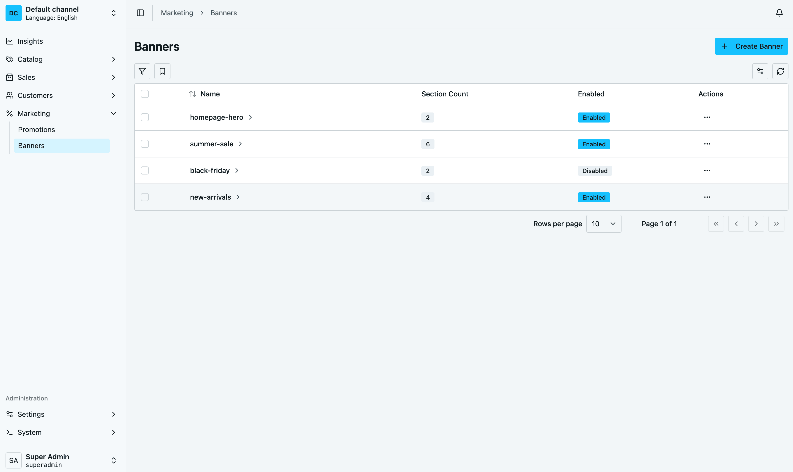
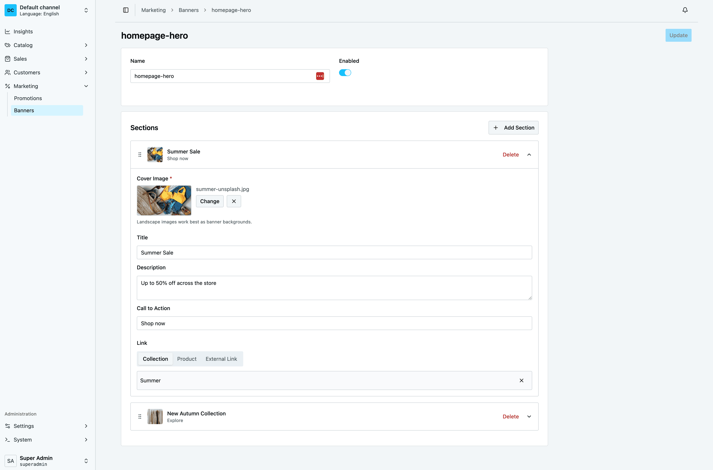

# Vendure Banner Plugin

[](https://www.npmjs.com/package/vendure-banner-plugin)
[](https://www.npmjs.com/package/vendure-banner-plugin)
[](https://github.com/arthur-nesterenko/vendure-plugin-banner/blob/main/LICENSE)
[](https://github.com/arthur-nesterenko/vendure-plugin-banner/actions/workflows/code-quality.yml)

A plugin for [Vendure](https://www.vendure.io/) that adds dynamic promotional banners to your e-commerce store. Create banners with multiple sections, each featuring translatable content, cover images, and links to products, collections, or external URLs.

## Preview


_All banners at a glance — section count and enabled state visible without drilling in._


_Multi-section editor with translatable content, link picker, and drag-and-drop reordering._

## Version Compatibility

| Plugin version | Vendure version | Admin UI | Status |
|---|---|---|---|
| **2.x** (current) | 3.x | React Dashboard | Active development |
| [**1.x**](https://github.com/arthur-nesterenko/vendure-plugin-banner/tree/v1) | 2.x – 3.x | Angular (`compileUiExtensions`) | Maintenance only |

> **Important:** v2 completely removes Angular UI support. If your project relies on the Angular-based admin UI or `compileUiExtensions`, use the [`v1` branch](https://github.com/arthur-nesterenko/vendure-plugin-banner/tree/v1) and install with `npm install vendure-banner-plugin@^1.0.0`.

## Features

- **Multi-section banners** — each banner supports multiple sections with independent content and ordering
- **Drag-and-drop reordering** — sort sections directly in the dashboard
- **Translatable content** — title, description, and call-to-action text per language (English, Ukrainian, Polish)
- **Flexible linking** — link each section to a product, collection, or external URL
- **Cover images** — attach images from the Vendure asset system
- **Shop API** — query banners by ID or name for your storefront
- **Event bus integration** — `BannerEvent` fires on create/update/delete for cache invalidation and side effects
- **Access control** — dedicated CRUD permissions for banner management in the admin

## Requirements

- Vendure `^3.0.0`
- Node.js `>=22`

## Getting Started

### 1. Install the plugin

```bash
npm install vendure-banner-plugin
```

### 2. Add it to your Vendure config

```typescript
import { BannerPlugin } from 'vendure-banner-plugin';

export const config: VendureConfig = {
    plugins: [
        BannerPlugin,
        // ...other plugins
    ],
};
```

The dashboard UI registers automatically. No `compileUiExtensions`, `AdminUiPlugin`, or additional build configuration is required.

### 3. Run a database migration

The plugin adds new tables for banners, sections, and translations. Generate and apply a migration:

```bash
npx vendure migrate
```

### 4. Manage banners

Open the Vendure dashboard. You'll find a **Banners** section in the navigation where you can create, edit, and organize your banners.

## Permissions

The plugin registers a CRUD permission set for banner management:

- `CreateBanner`
- `ReadBanner`
- `UpdateBanner`
- `DeleteBanner`

Grant these to any admin role that should manage banners via **Settings → Roles** in the dashboard.

## Querying Banners (Shop API)

Use the Shop API to fetch banners on your storefront.

**Get a banner by name:**

```graphql
query {
    bannerByName(name: "homepage-hero") {
        id
        name
        enabled
        sections {
            title
            description
            callToAction
            externalLink
            position
            asset {
                preview
            }
            product {
                id
                slug
            }
            collection {
                id
                slug
            }
        }
    }
}
```

**Get a banner by ID:**

```graphql
query {
    banner(id: "1") {
        id
        name
        sections {
            title
            callToAction
            asset {
                preview
            }
        }
    }
}
```

## Events

The plugin publishes a `BannerEvent` on Vendure's `EventBus` whenever a banner is created, updated, or deleted. Subscribe to it for cache invalidation, audit logs, or any other side effect that needs to react to banner changes.

```typescript
import { Injectable, OnApplicationBootstrap } from '@nestjs/common';
import { EventBus } from '@vendure/core';
import { BannerEvent } from 'vendure-banner-plugin';

@Injectable()
export class BannerCacheInvalidator implements OnApplicationBootstrap {
    constructor(private eventBus: EventBus) {}

    onApplicationBootstrap() {
        this.eventBus.ofType(BannerEvent).subscribe(event => {
            // event.bannerId — ID of the affected banner
            // event.type    — 'created' | 'updated' | 'deleted'
            // event.ctx     — RequestContext
            console.log(`Banner ${event.bannerId} was ${event.type}`);
        });
    }
}
```

A real-world use case: invalidating an [Stellate](https://stellate.co/) edge cache for the storefront whenever banners change, so customers always see fresh content without sacrificing CDN performance.

## Translations

The plugin handles two distinct kinds of translation — they're independent, so don't confuse them.

### 1. Banner content (storefront-facing)

Every `BannerSection` carries one translation row per language for `title`, `description`, and `callToAction`. Send translations as part of the input when creating or updating a banner via the Admin API:

```graphql
mutation {
    createBanner(input: {
        name: "homepage-hero"
        enabled: true
        sections: [{
            assetId: "1"
            position: 1
            translations: [
                { languageCode: en, title: "Summer Sale", description: "Up to 50% off", callToAction: "Shop now" }
                { languageCode: de, title: "Sommer-Sale", description: "Bis zu 50% Rabatt", callToAction: "Jetzt einkaufen" }
            ]
        }]
    }) {
        id
    }
}
```

On the Shop API, banners are returned already translated for the requesting client's language — the plugin resolves the right translation row based on the standard Vendure `languageCode` query argument or `Accept-Language` header. If a section has no translation for the requested language, Vendure falls back to the channel's default.

### 2. Dashboard UI (contributor-facing)

The admin dashboard UI is translated with [Lingui](https://lingui.dev). Catalogs live in `src/dashboard/i18n/{en,uk,pl}.po`. To add a new language:

1. Add the locale to `lingui.config.js`:

    ```js
    locales: ['en', 'uk', 'pl', 'de'],
    ```

2. Extract messages — this creates `de.po` and refreshes the existing catalogs:

    ```bash
    npm run i18n:extract
    ```

3. Translate the generated `de.po` (fill in the `msgstr` values).

After any code change that adds or edits a `<Trans>` element or `` t`…` `` call, run `npm run i18n:extract` again so all catalogs stay in sync.

## Migrating from v1 to v2

v2 is a major update that replaces the Angular admin UI with a native React-based Vendure Dashboard extension. **The backend API and database schema are unchanged** — no data migration is needed.

### What changed

| | v1 | v2 |
|---|---|---|
| **Admin UI** | Angular with `compileUiExtensions` | React Dashboard (auto-registered) |
| **UI setup** | Manual `AdminUiPlugin` configuration | Zero-config — just add `BannerPlugin` |
| **Vendure** | 2.x – 3.x | 3.x only |
| **i18n format** | JSON translation files | Lingui `.po` files |
| **Languages** | English, Ukrainian | English, Ukrainian, Polish |
| **Node.js** | >=18 | >=22 |

### Step-by-step migration

1. **Update the plugin:**

    ```bash
    npm install vendure-banner-plugin@latest
    ```

2. **Remove the old UI extension setup.** In your Vendure config, delete the `BannerPlugin.ui` reference and any related `compileUiExtensions` configuration:

    ```diff
    - import { compileUiExtensions } from '@vendure/ui-devkit/compiler';

      export const config: VendureConfig = {
          plugins: [
              BannerPlugin,
    -         AdminUiPlugin.init({
    -             port: 3002,
    -             route: 'admin',
    -             app: compileUiExtensions({
    -                 outputPath: path.join(__dirname, '../admin-ui'),
    -                 extensions: [BannerPlugin.ui],
    -             }),
    -         }),
          ],
      };
    ```

3. **Verify.** Start your Vendure server and open the dashboard. The Banners section should appear automatically.

### Staying on v1

If you're not ready to migrate or need the Angular UI, pin your dependency to v1:

```bash
npm install vendure-banner-plugin@^1.0.0
```

The v1 branch receives security fixes only. New features are developed exclusively on v2.

## Contributing

Contributions are welcome — bug fixes, new languages, and feature ideas alike. File issues on the [issue tracker](https://github.com/arthur-nesterenko/vendure-plugin-banner/issues).

### Local setup

```bash
git clone https://github.com/arthur-nesterenko/vendure-plugin-banner.git
cd vendure-plugin-banner
npm install        # Node >=22 required
npm run start      # Vendure on http://localhost:4000, dashboard at /dashboard
```

Login is `superadmin` / `superadmin`. The local dev database is `banner-vendure.sqlite` — delete it to reset.

### Commands

```bash
npm run codegen      # Regenerate generated-{admin,shop}-types.ts after schema changes
npm run test:unit    # Dashboard component tests (Vitest + jsdom)
npm run e2e          # Backend e2e tests (real Vendure test server)
npm run lint         # ESLint
npm run prettify     # Prettier
npm run build        # Production build
npm run i18n:extract # Refresh Lingui catalogs
```

Run a single test file with `npx vitest run --project unit <path>` or `--project e2e <path>`.

### Pull request guidelines

- **Conventional commits** are enforced (commitlint + husky). Use `npm run commit` if unsure of the prefix.
- Target the `main` branch. The `v1` branch is in security-fix maintenance only.
- Releases are automated via [release-please](https://github.com/googleapis/release-please) — `feat`, `fix`, `perf`, `deps`, `docs`, `revert` show up in the CHANGELOG; `chore`, `test`, `ci`, `build`, `style`, `refactor` are hidden.
- Run `npm run lint && npm run test:unit && npm run e2e` locally before opening the PR — CI runs the same checks.

For architecture details and gotchas when navigating the code, see [AGENTS.md](./AGENTS.md).

## License

MIT
